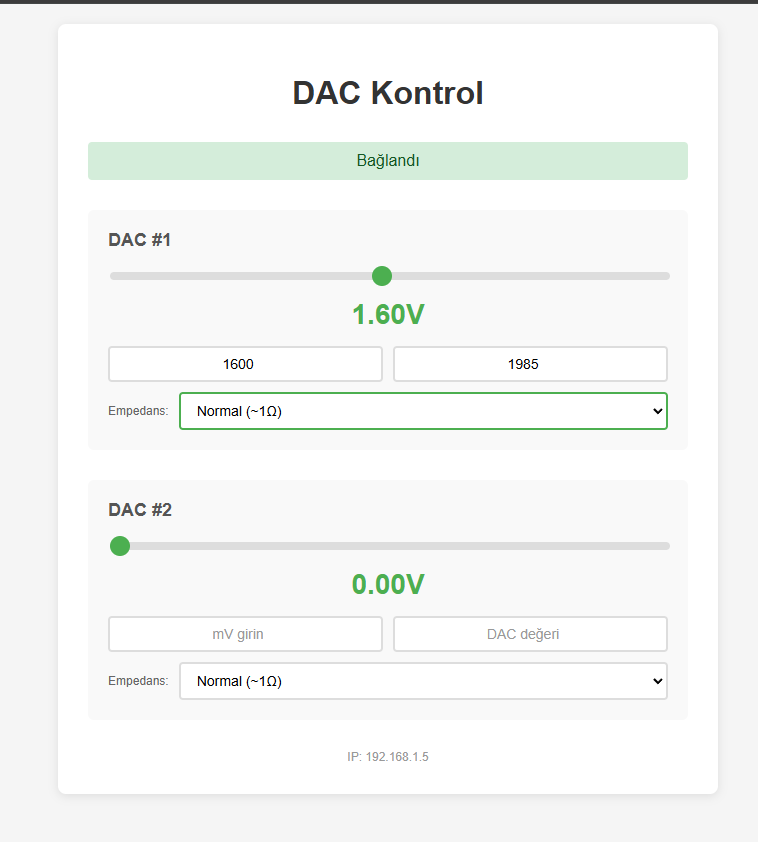
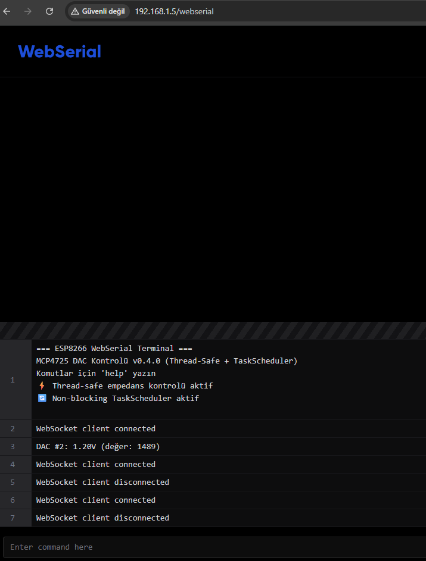
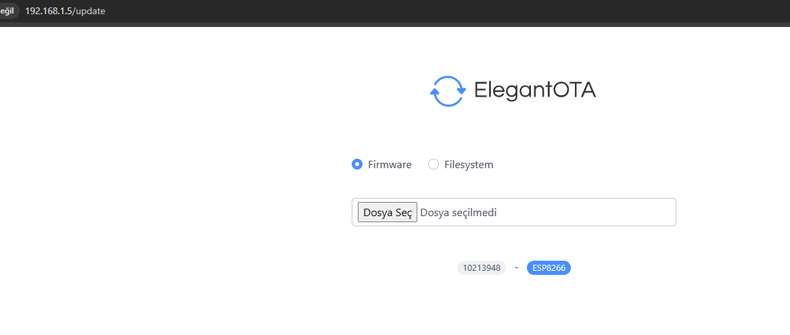
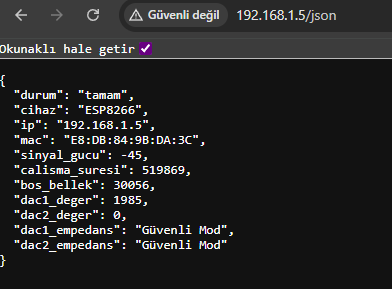

# ESP8266 MCP472

## 🛠️ Hardware

**ESP8266** (NodeMCU v2) + **2x MCP4725 DAC** modules
**I2C Addresses:** DAC#1=0x60, DAC#2=0x61

```
ESP8266        MCP4725
--------       -------
D1 (GPIO5) →   SCL
D2 (GPIO4) →   SDA
3.3V       →   VCC
GND        →   GND
```

## ⚡ Features

- 🎛️ **Dual MCP4725 DAC Control** - 12-bit precision, 0-3.3V output
- 🔄 **Thread-Safe Task System** - Non-blocking I2C operations  
- 🌐 **Real-time WebSocket** - Instant control feedback
- 💾 **Voltage Memory** - Auto-restore after empedans changes
- 📡 **WebSerial Terminal** - Built-in browser console
- 🔧 **OTA Updates** - Over-the-air firmware updates
- 📶 **ESPConnect WiFi** - Auto-configuration with fallback hotspot

🚀 **Thread-Safe ESP8266 Web Server** for dual MCP4725 DAC control with real-time WebSocket communication


## 🎮 Usage

### **Web Interface**
- 🎛️ **Sliders**: Real-time voltage control (0-3.3V)
- ⚡ **Empedans Modes**: Normal/1kΩ/100kΩ/500kΩ pull-down
- 💾 **Auto-Restore**: Voltage memory after empedans changes


### **WebSerial Debug Terminal**
Built-in browser-based debugging console with command support:

### **WebSerial Commands**
```
help         - Command list
i2c_scan     - Device discovery  
dac_info     - DAC status
status       - System info
reset        - Restart ESP8266
```

### **Elegant OTA Updates**
Over-the-air firmware updates without USB cable:



### **JSON API Response**
RESTful API endpoint for system status and DAC information:




### **WebSocket API**
```javascript
// Control DACs
ws.send("dac1:2048");              // Set DAC1 value
ws.send("dac1_impedance:2");       // Set empedans mode

// Receive updates
ws.onmessage = (e) => {
    const data = JSON.parse(e.data);
    // data.dac1, dac2, dac1_impedance, dac2_impedance
};
```

### **Available Endpoints**
```
http://<IP>/          - Main control interface
http://<IP>/webserial - Debug terminal  
http://<IP>/update    - OTA firmware upload
http://<IP>/json      - System status API
```

## 🏗️ Architecture

**Thread-Safe Task System** prevents ESP8266 crashes:
- ⚡ **WebSocket handlers** → Queue commands (interrupt-safe)
- 🔄 **Task scheduler** → Execute I2C operations (main loop)
- 💾 **Voltage memory** → Auto-restore system
- 🛡️ **Crash prevention** → No blocking operations in interrupts

```cpp
// Thread-safe empedans control
triggerDac1ImpedanceTask(mode);  // Queue → Task → Execute
```

## 🐛 Troubleshooting

| Problem | Solution |
|---------|----------|
| 🚫 DAC not responding | Check I2C connections, run `i2c_scan` |
| 📡 WebSocket disconnects | Check WiFi signal, monitor heap memory |
| ⚡ No voltage output | Empedans in power-down mode, set to "Normal" |
| 📤 Upload fails | Hold FLASH button, check USB cable |

## 📈 Performance

- **Memory**: RAM 47.7%, Flash 42.9%
- **Response**: WebSocket <10ms, DAC <5ms
- **I2C**: Non-blocking incremental scan

⭐ **Thread-Safe • Task-Based • Real-Time DAC Control** ⭐